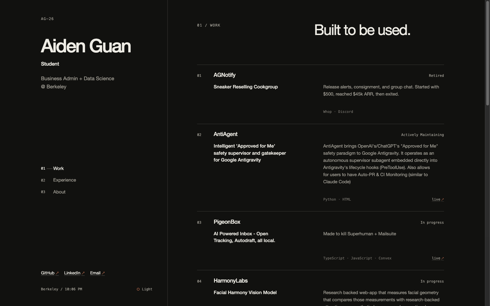
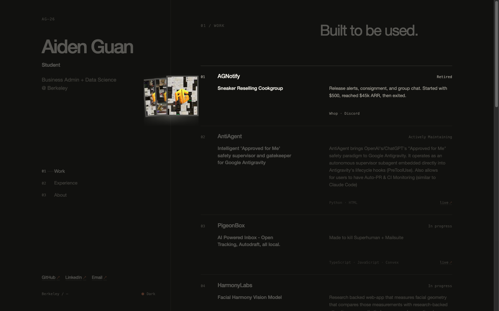
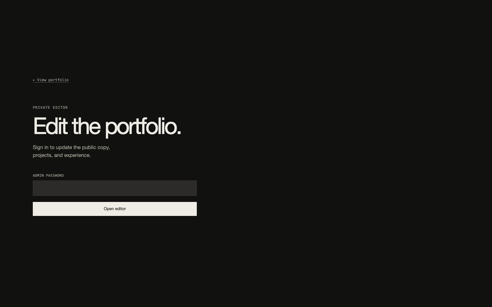
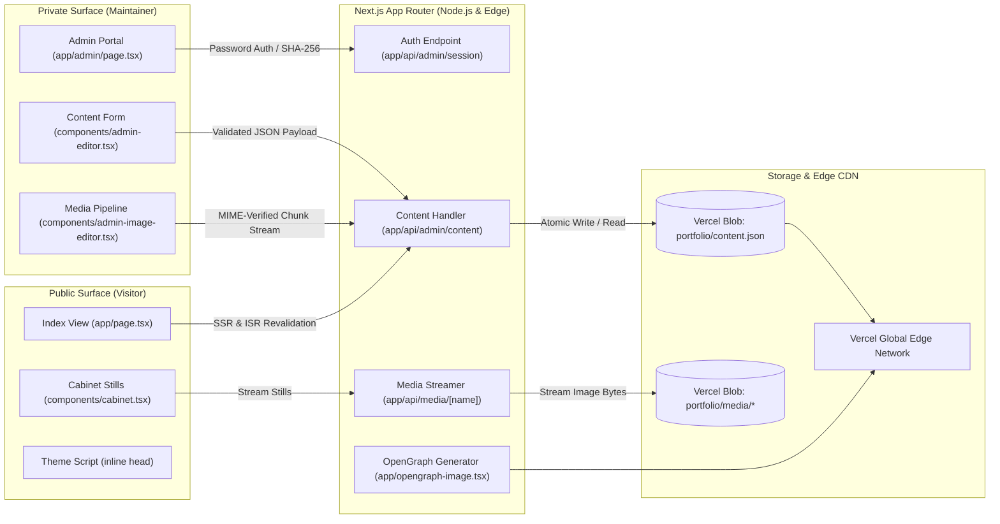

<div align="center">

# Aiden Guan — Index Portfolio

**A restrained, high-density index portfolio and private headless CMS built with Next.js 16, React 19, TypeScript, and Vercel Blob persistence.**

[Live Site](https://aidenguan.com) · [Architecture](#system-architecture) · [Admin CMS](#private-headless-cms-admin-editor) · [Engineering Deep Dives](#engineering-deep-dives) · [Quick Start](#getting-started)

<br/>

[](https://aidenguan.com)
[](https://nextjs.org/)
[](https://react.dev/)
[](https://www.typescriptlang.org/)
[](LICENSE)

<br/>



</div>

---

## Overview

This repository powers **[aidenguan.com](https://aidenguan.com)**, the personal index of Aiden Guan (studying Business Administration and Data Science at UC Berkeley).

Rather than relying on heavy graphic templates, third-party portfolio builders, or static Markdown files requiring continuous git commits, the application couples an austere Swiss typographic layout with a private, authenticated in-browser CMS. Content edits and project stills publish instantly to production via private Vercel Blob document storage with zero build latency and zero redeployment requirements.

---

## Core Capabilities

| Cabinet Stills Drawer | Private In-Browser Headless CMS |
| :--- | :--- |
|  |  |
| **Interactive Print Fan**: Hovering or focusing any work entry triggers a hardware-accelerated drawer that slides out image stills with mathematical tilt transforms (`--tilt`) while softly dimming the rest of the interface to spotlight the active project. | **Zero-Redeploy Publishing**: Dedicated `/admin` route protected by cryptographic session tokens. Allows full editing of profile copy, social links, section titles, project details, and asset uploads directly to Vercel Blob. |

| Zero-Flicker Theme Engine | Edge OpenGraph & Canonical SEO |
| :--- | :--- |
| **Instant Dark / Light Adaptation**: Zero-dependency inline `<head>` script evaluates `localStorage` and OS `prefers-color-scheme` before the DOM paints, eliminating theme flash (FOIT) without layout shift. | **Edge Social Generation**: Dynamically generates high-resolution Open Graph image cards via `@vercel/og` with automatic sitemap generation and canonical metadata routing. |

---

## System Architecture

The project operates across a dual-surface architecture separating public visitor presentation from authenticated content persistence.



### End-to-End Workflow

1. **Request Intake**: Incoming requests to `aidenguan.com` hit the Next.js App Router (`app/page.tsx`).
2. **Content Resolution**: `getPortfolioContent()` checks for configured Vercel Blob credentials. If present, it retrieves the live private `portfolio/content.json` document with a 60-second cache-control window; otherwise, it falls back to typed schema defaults in `content/portfolio.ts`.
3. **Payload Sanitization**: Payloads pass through `parsePortfolioContent()`, which validates all strings, arrays, safe URI protocols (`http:`, `https:`, `mailto:`), and bounds check text lengths.
4. **DOM Painting & Theme Application**: An inline script in `<head>` applies `dataset.theme` prior to paint. The server renders the typographic grid, Berkeley timezone clock, and project index.
5. **Interactive Cabinet Expansion**: When a pointer hovers or keyboard focuses (`tabIndex={0}`) on a project row, CSS `:has()` rules dim sibling elements while evaluating CSS custom properties (`--tilt`, `--count`, `--i`) to fan the project prints.
6. **Authenticated Publishing**: When the maintainer accesses `/admin`, credentials authenticate against SHA-256 session cookies. Updated JSON documents write atomically to Vercel Blob via `savePortfolioContent()`, updating public visitor traffic on subsequent requests.

---

## Private Headless CMS & Admin Editor

The repository integrates a full-featured content management suite under `app/admin/`:

- **Session Security**: Session tokens are cryptographically derived via SHA-256 hashes of the admin password paired with HTTP-only, secure, `SameSite=Strict` cookies (`lib/admin-auth.ts`).
- **Input Validation**: Strict parser contracts (`lib/portfolio-content.ts`) reject malformed JSON, enforce maximum character lengths, restrict URL schemes to safe web protocols, and sanitize image pathnames.
- **Media Upload Pipeline**: Client-side byte sniffing (`lib/portfolio-media.ts`) verifies magic signatures for JPEG, PNG, WebP, GIF, and AVIF formats, enforcing a 4 MB per-image ceiling before issuing private Vercel Blob writes.
- **Local Development Proxy**: When running locally without active Blob credentials, `app/api/media/[name]/route.ts` proxies remote media directly from `aidenguan.com`, ensuring local interface verification without requiring production cloud tokens.

---

## Engineering Deep Dives

### 1. Zero-Redeploy Content Management via Private Blob Document Store

- **Problem**: Personal sites historically force a compromise: static flat-files require git commits and full Next.js CI/CD rebuilds for minor copy edits, while traditional headless CMS platforms or SQL databases introduce cold starts, recurring infrastructure costs, and complex migration workflows.
- **Approach**: Built a single-document JSON persistence model on top of `@vercel/blob` (`portfolio/content.json`). Read paths run through `getPortfolioContent()` with atomic fallback to `defaultPortfolio`. Write operations in `app/api/admin/content/route.ts` validate schema integrity through `parsePortfolioContent()` before issuing atomic overwrite puts.
- **Why**: Eliminates build-step dependencies for content updates and provides zero-cost persistence that deploys inside standard Vercel infrastructure without maintaining external database clusters.
- **Tradeoff**: Concurrency is optimized for a single author. Simultaneous multi-user edits rely on last-write-wins semantics rather than operational transforms (CRDTs).

### 2. Hardware-Accelerated Cabinet Stills with Non-Destructive Focus Navigation

- **Problem**: Presenting visual project screenshots within a dense, text-first editorial grid typically results in cluttered vertical cards or jarring modal dialogs that disrupt keyboard navigation.
- **Approach**: Implemented a drawer architecture (`components/cabinet.tsx` and `app/globals.css`) using CSS transforms (`translate3d`, `rotate`, `scale`). Each card receives dynamic custom properties `--i` and `--count` calculating rotational fanning (`--tilt`). Utilizing CSS `:has(.project-row:hover)` and `:has(:focus-visible)`, the page dims ambient text (`opacity: var(--spotlight)`) and elevates the active row.
- **Why**: Keeps the initial viewport minimalist and typographic while providing immediate visual depth on demand without layout reflow (CLS = 0).
- **Tradeoff**: Advanced fanning interactions require modern browser CSS `:has()` support. For legacy browsers, fallbacks gracefully maintain text readability without the hover spotlight.

### 3. Zero-Hydration-Flash Dark & Light Theme Architecture

- **Problem**: React App Router components hydrating asynchronously often cause a bright white flash when a visitor has selected dark mode (FOIT) if theme state is resolved within `useEffect`.
- **Approach**: Injected an inline script block directly inside `app/layout.tsx` `<head>` before any body elements render. The script synchronously evaluates `localStorage.getItem('aiden-theme')` or system `window.matchMedia('(prefers-color-scheme: dark)')` and stamps `data-theme` directly onto `document.documentElement`.
- **Why**: Completely prevents visual theme flashing during page load without adding third-party theme package weight.
- **Tradeoff**: Requires `suppressHydrationWarning` on the root `<html>` tag to prevent React hydration mismatch warnings.

---

## Technology Stack

### Client & Presentation
- **Framework**: Next.js 16.3.4 (App Router, Server Components)
- **UI Runtime**: React 19.2.8
- **Typography & Styling**: Custom CSS custom properties, responsive split-column layout, and CSS `:has()` selectors
- **Media Optimization**: Next.js Image component with responsive sizing and layout containment

### Server & Route Handlers
- **API Handlers**: Node.js route handlers (`app/api/admin/*`, `app/api/media/*`)
- **Metadata Engine**: Dynamic OpenGraph generation (`@vercel/og`), dynamic `sitemap.xml`, and `robots.txt`
- **Domain Routing**: Centralized canonical URL resolver (`lib/site-url.ts`) prioritizing `aidenguan.com`

### Persistence & Storage
- **Document Store**: `@vercel/blob` private storage (`portfolio/content.json`)
- **Media CDN**: `@vercel/blob` private media storage (`portfolio/media/*`)

### Security & Authentication
- **Session Verification**: SHA-256 cryptographic message hashing with HTTP-only cookies
- **MIME & Byte Verification**: Magic-byte signature checking for image uploads
- **Sanitization**: Strict length bounding and URL protocol whitelist validation

---

## Getting Started

### Prerequisites
- Node.js 20.x or higher
- npm (v10 or higher)

### Quick Start

1. **Clone the repository**:
   ```bash
   git clone https://github.com/aiden-guan/portfolio-2.git
   cd portfolio-2
   ```

2. **Install dependencies**:
   ```bash
   npm install
   ```

3. **Configure local environment**:
   ```bash
   cp .env.example .env.local
   ```

4. **Launch development server**:
   ```bash
   npm run dev
   ```
   Open [http://localhost:3000](http://localhost:3000) in your browser. The site will boot with typed default content and proxy remote images from production.

---

## Configuration & Environment Variables

| Variable | Required | Description |
| :--- | :---: | :--- |
| `NEXT_PUBLIC_SITE_URL` | Optional | Canonical site origin (defaults to `https://aidenguan.com` in production and `http://localhost:3000` in dev). |
| `ADMIN_PASSWORD` | Optional | Shared password required to authenticate into the `/admin` editor portal. |
| `BLOB_READ_WRITE_TOKEN` | Optional | Access token automatically injected by Vercel when linking a Blob storage store. |

---

## Repository Structure

```text
portfolio-2/
├── app/
│   ├── admin/               # Private in-browser CMS editor portal (/admin)
│   ├── api/
│   │   ├── admin/           # Authenticated session, content, and media API handlers
│   │   └── media/[name]/    # Secure image streaming route with dev fallback proxy
│   ├── globals.css          # Core design tokens, layout grids, and cabinet animations
│   ├── layout.tsx           # Root layout, zero-flicker theme script, and canonical metadata
│   ├── opengraph-image.tsx  # Dynamic 1200x630 OpenGraph card generation via @vercel/og
│   ├── page.tsx             # Main index server component assembling work, experience & bio
│   ├── robots.ts            # Dynamic robots.txt generation
│   └── sitemap.ts           # Dynamic sitemap.xml generation
├── assets/
│   └── readme/              # High-resolution README presentation assets
├── components/
│   ├── admin-editor.tsx     # Full reactive admin editor form interface
│   ├── cabinet.tsx          # Fanned card print drawer for project stills
│   ├── index-navigation.tsx # High-contrast section anchor navigation
│   ├── local-time.tsx       # Live-updating Berkeley time calculation
│   └── project-index.tsx    # Accessible project list with focus and hover handlers
├── content/
│   └── portfolio.ts         # Schema definitions, type guards, and fallback content
├── lib/
│   ├── admin-auth.ts        # SHA-256 session token generation and cookie management
│   ├── portfolio-content.ts # Blob retrieval, payload parsing, and validation guards
│   ├── portfolio-media.ts   # Magic-byte file validation and blob uploader
│   └── site-url.ts          # Canonical site origin resolver
├── public/                  # Static web manifests and icons
├── LICENSE                  # MIT License
└── package.json             # Scripts and dependencies
```

---

## Verification & Quality Checks

Run the automated verification suite:

```bash
# Run ESLint validation
npm run lint

# Run TypeScript typecheck
npm run typecheck

# Execute production build
npm run build
```

---

## Status & Limitations

- **Maturity**: In active production use at [aidenguan.com](https://aidenguan.com).
- **Concurrency**: Storage uses single-document atomic overwrite semantics; concurrent administrative editors are not synchronized in real-time.
- **Media Storage**: In local development without `BLOB_READ_WRITE_TOKEN`, new image uploads are saved locally to `public/portfolio-media/`.

---

## License

This project is licensed under the MIT License — see the [LICENSE](LICENSE) file for details.
